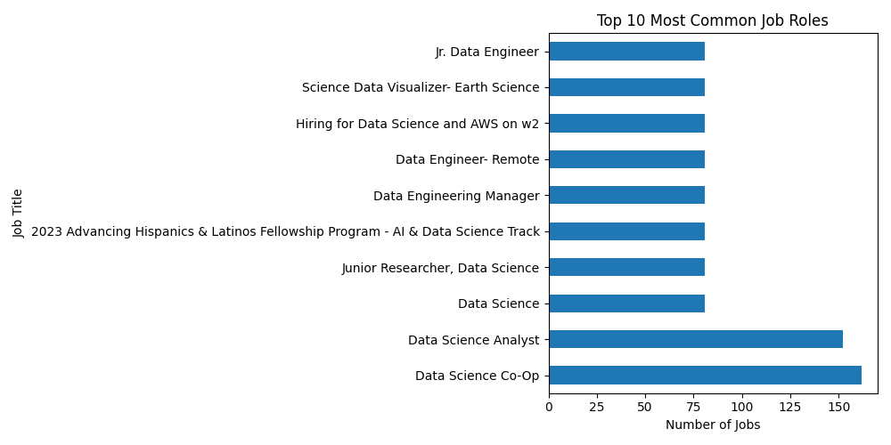
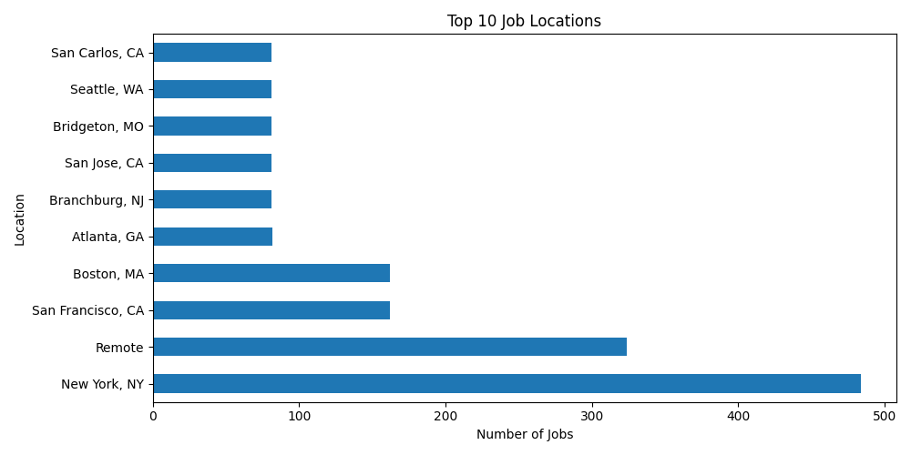

# Job Market Data Analyzer

This project analyzes job market data using Python.

## Tools Used
- Python
- Pandas
- Matplotlib
- VS Code

## Features
- Reads job dataset
- Analyzes popular job roles
- Visualizes job trends using charts

## Output Screenshots

## Author
Aarthy V